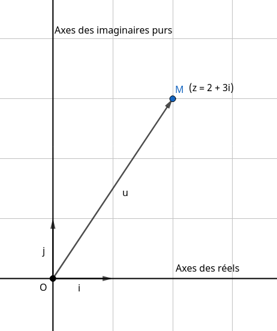

## Définition

### Théorème

* On admet l'existance d'un ensemble de nombres appelé **nombres complexes** : $\mathbb{C}$, contenant $\mathbb{R}$ l'ensemble de tous les réels.
* $\mathbb{C}$ est muni de deux opérations élémentaires, l'addition et la multiplication.
* $\mathbb{C}$ comporte un nombre noté $i$, le nombre imaginaire, tel que $i^2 = -1$.
* Tout élement $z$ de $\mathbb{C}$ possède une **écriture unique** sous la forme $z = a + ib,\:(a ,b) \in \mathbb{R}^2$

???+ info inline end "Exemples de nombres complexes"
    * $3x$
    * $\sqrt{15}$
    * $2i$
    * $x + 2i$
    * $\frac{\sqrt{x + 2}}{3} - 3i$

!!! warning "Remarque"
    Dans $\mathbb{C}$ on définit des opérations comme dans $\mathbb{R}$, mais pas de relation d'ordre comme $x > y$. Il est alors faux de noter $z \geq z'$ si $z$ et $z'$ sont deux nombres complexes non réels.

### Vocabulaire

* Dans la notation d'un nombre complexe, on trouve deux parties distinctes, la partie réelle et la partie imaginaire. Prennons $z = a + ib$, ici $a$ est **la partie réelle** et $b$ **la partie imaginaire**.
* La **forme algébrique** du nombre complexe $z$ s'écrit sous la forme $z = a + ib$
* Si la partie réelle d'un nombre complexe est nulle, donc $a = 0$, on dit qu'il s'agit d'un nombre imaginaire pur.

???+ info "Propriété"
    On dit que deux nombres complexes $z$ et $z'$ sont égaux **si et seulement si** leurs parties réelles et imaginaires sont égales :

    $$
    \begin{cases}
    z = a + ib\\
    z' = x + iy
    \end{cases}
    $$

    $$
    z = z' \Leftrightarrow \begin{cases}
    a = x\\
    b = y
    \end{cases}
    $$

    On note aussi qu'un nombre complexe est nul **si et seulement si** sa partie réelle  et sa partie imaginaire sont nulles.

## Représentation géométrique

Oui il faut un peu parler de géométrie pour mieux se représenter un nombre complexe. Prennons le plan $P$, muni d'un repère orthonormé $(O; \vec{i}; \vec{j})$, ainsi que le point $M(2; 3)$ :

{ loading=lazy }

???+ info "Propriété"
    À tout nombre complexe $x = a + ib$, on associe :

    * un point $X(a; b)$ sur le plan $P$.
    * un vecteur $\vec{v}(a; b)$.

    On dit que $M$ est l'image de $z$, et inversement, $z$ est l'affixe de $M$. On dit aussi que $z$ est l'affixe du vecteur $\vec{u}$.

### Calculs d'affixes

1. Soient $A$ et $B$ deux points d'affixes $z_{A}$ et $z_{B}$.

    L'affixe du vecteur $\vec{AB}$ vaut $z_{\vec{AB}} = z_{B} - z_{A}$.

    L'affixe du milieu $M$ du segment $[AB]$ vaut $z_{M} = \frac{z_{A} + z_{B}}{2}$.

2. Soient deux vecteurs du plan $P$, $\vec{u}(z)$, $\vec{v}(z')$ et un nombre réel $k$.

    L'affixe du vecteur $\vec{w} = \vec{u} + \vec{v}$ vaut $z + z'$.

    L'affixe du vecteur $k\vec{u}$ vaut $kz$.

## Forme trigonométrique

### Définitions

???+ info "Définition"
    Soient $z = a +ib$ un complexe non nul dans le repère orthonormé $(O; \vec{i}; \vec{j})$ et son image $M$.

    * On appelle **module de $z$** le nombre réel positif noté $|z| = \sqrt{a^2 + b^2}$. *Il s'agit aussi de la norme du vecteur $\vec{OM}$*.
    * On appelle **argument de $z$** la mesure en radians de l'angle $(\vec{i}; \vec{OM})$, noté $arg(z)$.

???+ info "Propriétés des modules"
    $\forall (z, z') \in \mathbb{C}^2$ :

    * $|z|^2 = z \times \overline{z}$
    * $|zz'| = |z| \times |z'|$
    * $|\frac{z}{z'}| = \frac{|z|}{|z'|}, \forall z' \ne 0$

???+ info "Propriétés des arguments"
    $\forall (z, z') \in \mathbb{C}^2, (z, z')$ non nuls et $\forall n \in \mathbb{Z}$ :

    * $arg(\overline{z}) = -arg(z)$
    * $arg(zz') = arg(z) + arg(z')$
    * $arg(z^n) = n \times arg(z)$
    * $arg(\frac{z}{z'}) = arg(z) - arg(z')$

???+ info "Remarque"
    * $arg(-z) = arg(z) + arg(-1) = arg(z) + \pi$
    * $arg(\frac{1}{z}) = arg(1) - arg(z) = - arg(z)$

### Forme trigonométrique

La **forme trigonométrique** du nombre complexe $z$ est $z = |z|(\cos(arg(z)) + i\sin(arg(z)))$. En posant $r = |z|$ et $\theta = arg(z)$, on obtient :

$$
z = r(\cos\theta + i\sin\theta)
$$

On utilisera l'identité trigonométrique pythagoricienne pour passer un nombre complexe de sa forme algébrique à sa forme trigonométrique, et inversement.

??? info "Exemple"
    Donner la forme trigonométrique du nombre complexe $z = 1 + i$.

    La forme trigonométrique de $z$ est de la forme $z = r(\cos\theta + i\sin\theta)$.

    Calcul du module de $z$ :

    $$
    r = |z| = \sqrt{a^2 + b^2} = \sqrt{1^2 + 1^2} = \sqrt{2}
    $$

    Calcul de $\cos\theta$[^1] :

    [^1]: Utilisation de l'identité trigonométrique pythagoricienne $\cos\theta = \frac{adjascent}{hypothénuse}$.

    $$
    \cos\theta = \frac{a}{r} = \frac{1}{\sqrt{2}} = \frac{\sqrt{2}}{2}
    $$

    Calcul de $\sin\theta$[^2] :

    [^2]: Utilisation de l'identité trigonométrique pythagoricienne $\sin\theta = \frac{opposé}{hypothénuse}$.

    $$
    \sin\theta = \frac{b}{r} = \frac{1}{\sqrt{2}} = \frac{\sqrt{2}}{2}
    $$

    Déduction de $\theta$[^3] :

    [^3]: Voir [les valeurs remarquables trigonométriques](https://fr.wikipedia.org/wiki/Cercle_trigonom%C3%A9trique#Valeurs_remarquables).

    $$
    \theta = \frac{\pi}{4}
    $$

    Au final, la forme trigonométrique du nombre complexe $z$ est :

    $$
    z = \sqrt{2}(\cos\frac{\pi}{4} + i\sin\frac{\pi}{4})
    $$

    *Remarque :* en simplifiant cette forme on retrouve bien la forme algébrique initiale $z = 1 + i$.

## Forme exponentielle

La **forme exponentielle** d'un nombre complexe $z$, avec $r = |z|$ et $\theta = arg(z)$ est $z = re^{i\theta}$

En effet les [propriétés des arguments](#définitions) d'un nombre complexe justifient la notation exponentielle.

???+ info "Propriétés"
    $\forall (\theta, \theta') \in \mathbb{R}^2$, $\forall n \in \mathbb{N}$ :

    * $e^{i\theta} \times e^{i\theta'} = e^{\theta + \theta'}$
    * $(e^{i\theta})^n = e^{in\theta}$
    * $\frac{e^{i\theta}}{e^{i\theta'}} = e^{i(\theta - \theta')}$

## Le conjugué

???+ info inline end "Exemple"
    Pour $z = 3 + 4i$, $\overline{z} = 3 - 4i$
    Pour $z = \sqrt{3} - \frac{3}{4}i$, $\overline{z} = \sqrt{3} + \frac{3}{4}i$

On note $\overline{z} = a - ib$ le conjugué de $z = a + ib$.

???+ info "Propriétés"
    $\forall (z, z') \in\mathbb{C}^2, n \in \mathbb{N}$:

    * $\overline{z + z'} = \overline{z} + \overline{z'}$
    * $\overline{zz'} = \overline{z} . \overline{z'}$
    * $\overline{\frac{z}{z'}} = \frac{\overline{z}}{\overline{z'}}, z' \ne 0$
    * $\overline{z^n} = \overline{z}^n$

    Le conjugué d'un nombre complexe est son symétrique par rapport à l'axe des abscisses (axe des réels).

## Équation du second degré

Pour les équations du second degré nous étions bloqués en cas de discriminant négatif. En effet la fonction racine carrée étant définie sur $[0 ; +\infty[$, un discriminant réel négatif rend alors l'expression $\frac{- b \pm \sqrt{\Delta}}{2a}$ impossible à résoudre dans $\mathbb{R}$.

Cependant, dans $\mathbb{C}$ il est tout à fait envisagable de résoudre une ESD avec un discriminant négatif.

Nous avons alors comme solutions de l'équation $az^2 + bz +c = 0$, avec toujours $\Delta = b^2 - 4ac$ :

* Si $\Delta > 0$ :

$z_{1} = \frac{-b + \sqrt{\Delta}}{2a}$ et $z_{2} = \frac{-b - \sqrt{\Delta}}{2a}$

* Si $\Delta = 0$ :

$z_{0} = \frac{-b}{2a}$

* Si $\Delta < 0$ :

$z_{1} = \frac{-b + i\sqrt{-\Delta}}{2a}$ et $z_{2} = \frac{-b - i\sqrt{-\Delta}}{2a}$

??? info "Exemple"
    Résolvons l'équation $f(z) = 0$ dans $\mathbb{C}$, avec :

    $$
    f(z) = 2z^2 - 3z + 6
    $$

    Il s'agit d'une ESD, nous allons déterminer la ou les solutions possibles dans $\mathbb{C}$ de $f(z) = 0$.

    Calcul du discriminant :

    $$
    \Delta = b^2 - 4ac = (-3)^2 - 4(2 \times 6) = -39
    $$

    Nous trouvons un discriminant négatif. L'équation $f(z) = 0$ comprend deux solutions conjuguées dans $\mathbb{C}$ : $z_{1} = \frac{-b + i\sqrt{-\Delta}}{2a}$ et $z_{2} = \frac{-b - i\sqrt{-\Delta}}{2a}$.

    Calcul de la première racine :

    $$
    z_{1} = \frac{-(-3) - i\sqrt{-(-39)}}{2 \times 2} = \frac{3 - i\sqrt{39}}{4}
    $$

    En dćoule alors la seconde :

    $$
    z_{2} = \frac{3 + i\sqrt{39}}{4}
    $$

    Au final, l'équation $f(z) = 0$ admet deux solutions dans $\mathbb{C}$ :

    $$
    S = \{\frac{3 - i\sqrt{39}}{4} ; \frac{3 + i\sqrt{39}}{4}\}
    $$

## Exercices

Un jour peut-être. Avec des corrigés en plus.

---

???+ info "Sources"
    * [https://www.maths-cours.fr/cours/nombres-complexes-geometrie/](https://www.maths-cours.fr/cours/nombres-complexes-geometrie/)
    * [https://fr.wikipedia.org/wiki/Cercle_trigonom%C3%A9trique](https://fr.wikipedia.org/wiki/Cercle_trigonom%C3%A9trique)
    * [https://fr.wikipedia.org/wiki/Identit%C3%A9_trigonom%C3%A9trique_pythagoricienne](https://fr.wikipedia.org/wiki/Identit%C3%A9_trigonom%C3%A9trique_pythagoricienne)
    * Moi et mon cahier

--8<-- "includes/abbreviations.md"

